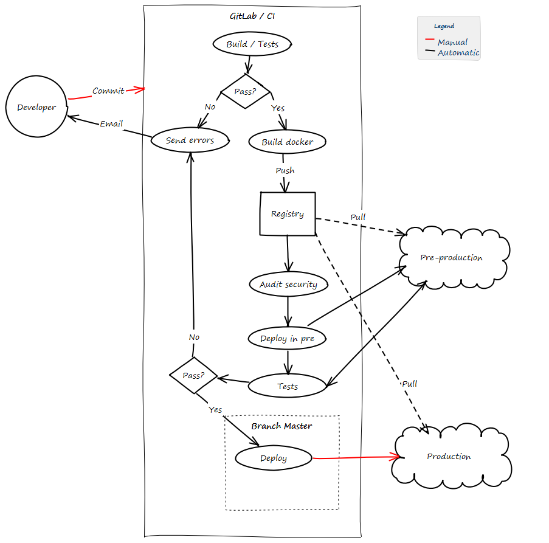

# Integración Continua
Para el desarrollo de REDMIC se utiliza un entorno de integración continua, en adelante CI. Esto permite que cada modificación subida a GitLab, pasa una batería de tests.

{: .center}