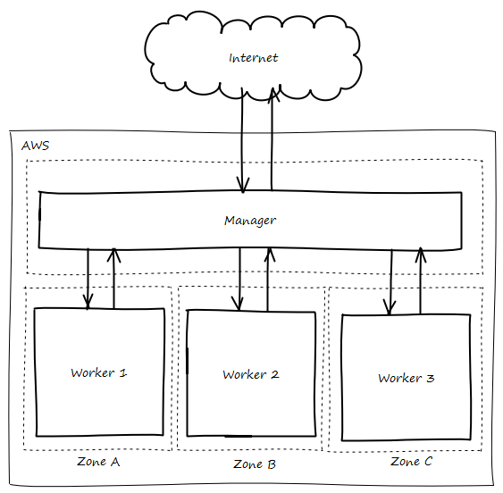

# Sistema

## Estructura
A finales de 2018, se cuentan con 4 servidores. Se utiliza docker swarm
{: .center}

Todos los servidores pertenecen a una misma red (VPC), cada zona cuenta con una subred además de una exclusiva para el manager, es decir, en total existen 4 subredes. Esto hace que si en un futuro aumenta el número de servidores, los nuevos equipos se unirán a las subredes existentes, siempre que no existan restricciones.

El "manager" es el encargado de exponer de exponer los diferentes servicios a Internet, es por eso que es el único servidor accesible desde el exterior, siempre controlando que puertos se exponen a través de reglas de firewall.

Los "workers" son servidores donde se ejecutan los servicios, están distribuidos entre las 3 zonas que provee Amazon en la región "eu-west-1", esta distribución evita que la aplicación deje de responder si alguna de las zonas cae.

Esta configuración de servidores adoptada viene impuesta por Docker Swarm, dónde existe uno o varios managers, encargados del reparto de tareas, y un conjunto de servidores workers, donde se desplegan las distintas herramientas.

### Despliegue
Para el aprovisionamiento de todas estas máquinas, con sus respectivos requisitos se ha utilizado como base la plantilla de CloudFormation que proporciona [Docker for AWS](https://docs.docker.com/docker-for-aws){: target="_blank"}. Dicha plantilla ha sido personalizada, debido a un problema con el plugin [CloudStor](https://docs.docker.com/docker-for-aws/persistent-data-volumes){: target="_blank"} y el almacenamiento tipo EFS, que hacia que el comportamiento de la aplicación no fuese el adecuado, así que se optó por reemplazar la imagen base utilizada, Moby Linux, por Ubuntu Server, debido ha que la imagen original era la causante del problema.

En la plantilla se definen varios parámetros:

* Nombre del stack
* Número de servidores managers y workers
* Clave SSH para conectar a las máquinas
* Tipo de instancias AWS, tanto para managers como workers
* Tipo de discos y capacidades de los mismos

## Gestión
Todas los servicios que componen REDMIC trabajan dentro de un contenedor, esto permite aislar cada servicio del entorno de ejecución, evitando problemas de versiones de librerías, conflictos de configuraciones, etc. La distribución de los contenedores en los diferentes servidores es responsabilidad de Docker Swarm, pero en ciertos casos es necesario forzar la distribución a un servidor específico, para ello se siguen ciertos criterios:

* Analizar las cargas de los servidores, para evitar tener servidores con cargas desbalanceadas.
* Dependencias entre servicios, si hay dependencia entre servicios, y siempre que sea posible se despliegan en el mismo servidor para reducir la latencia de transferencia de datos. Un ejemplo puede ser el contenedor encargado de realizar el backup de la base de datos, sería conveniente que se ejecute en la misma máquina donde se encuentra la base de datos, de esta forma se evita tráfico de red.

Para los contenedores con necesidades de persistencia de datos, se utilizan volúmenes, para este acometido se ha instalado el plugin CloudStor, ya que permite de forma transparente utilizar diferentes tipos de discos:

* *EBS* discos que solo pueden ser usados en una máquina.
* *EFS* discos que puede ser compartidos por diferentes máquinas.

Ambas configuraciones son pasadas desde los ficheros de configuración de despliegue de cada servicio.

!!! tip
    Cuando un servicio hace uso intensivo de disco, por ejemplo caché de Nginx, se pueden montar varios volúmenes (EBS) en diferentes directorios, y repartir la caché entre estos discos. De esta forma se reduce la latencia de acceso a disco.

    Esto será solo posible si el servicio permite el uso de varios directorios de trabajo.
