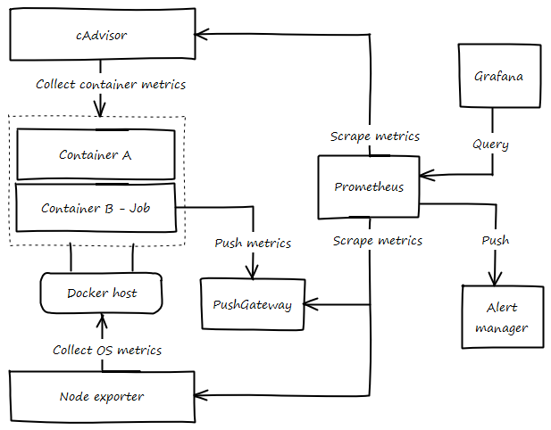
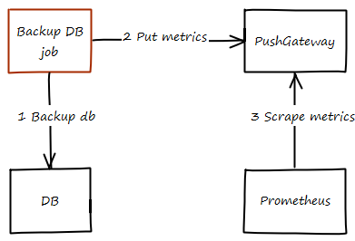

# Monitorización
## Métricas
Como todo buen sistema, se necesitan datos que permitan analizar el rendimiento, para ello REDMIC, al usar un sistema como Docker Swarm, se ha optado por usar [SwarmProm](https://github.com/stefanprodan/swarmprom){: target="_blank"}, un proyecto que aglutina varias herramientas para realizar monitorización de un entorno Docker Swarm.

{: .center}

### Prometheus
Open source

### cAdavisor
cAdvisor es un sistema de monitorización de contenedores, implementado por Google, que permite analizar los recursos usados por un contenedor en ejecución así como su rendimiento.

{: .shadow}

### Node-exporter
Node-exporter es una herramienta que expone métricas del servidor donde está instalado, para ello recopila datos sobre usos de memoria, disco o CPU, así como de tráfico E/S.

### dockerd-exporter
Colecta métricas del servicio de docker

### PushGatewayPus
Algunos contenedores no están continuamente en ejecución y a menudo solo se encargan de realizar una acción momentáneamente como una copia de seguridad de una base de datos, realizar una tarea de mantenimiento, etc. Este tipo funcionamiento hace que Prometheus no pueda recopilar datos de ellos, así que para resolver este problema, se utiliza PushGateway.

{: .center}

Cuando un contenedor de este tipo necesita exponer una métrica, realiza un PUT al servicio de PushGateway con la métrica, este la almacena para que Prometheus la pueda leer. La métrica no será actualizada hasta que el contenedor no vuelva a realizar un PUT con nuevos datos.

### Granafa
Permite crear dashboard donde comprobar la salud, rendimiento de los diferentes servicios.

---

## Alertas
Para 
### Alert manager

## Chequeo de salud
Los contenedores tienen un chequeo de salud, que permite comprobar si el contenedor está funcionando correctamente. Si el chequeo detecta que el funcionamiento no es correcto, el contenedor es parado y se arranca una nueva instancia.

---

## Logs
CloudWatch centraliza los logs de los diferentes contenedores.