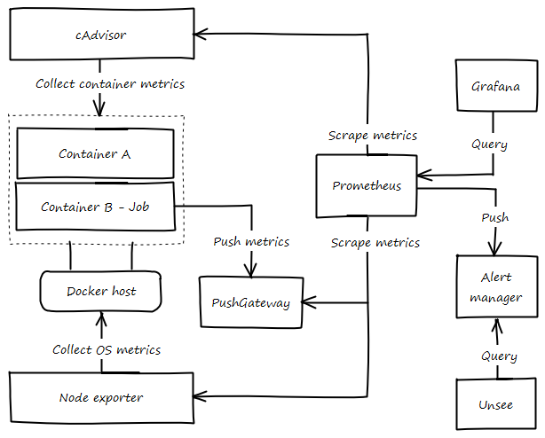

# Monitorización

### Portainer
[Portainer](https://portainer.io){: target="_blank"} es un herramienta web para manejar el entorno Docker Swarm, lo que facilita ver el estado del sistema sin tener que acceder a los servidores directamente.

{: .shadow}

Algunas tareas:

* Ajustar configuración de recursos, CPU o memoria.
* Cambiar valores pasados por variables de entorno.
* Editar etiquetas de los servicios.
* Editar los requisitos (constraints) a cumplir por los servidores.
* Permite ver la distribución de los contenedores dentro de cada servidor, algo bastante a la hora de repartir los contenedores.
* Listar imágenes, contenedores y volúmenes.
* Editar secretos y configuraciones.

## Métricas
Como en todo buen sistema, es necesario contar con una herramienta que permita analizar el rendimiento del sistema, con el fin de detectar problemas, optimizar recursos, actuar en picos de alta demanda, etc.

[SwarmProm](https://github.com/stefanprodan/swarmprom){: target="_blank"}, es la base para realizar la monitorización de REDMIC. Este proyecto aglutina diferentes servicios de recolecta y visualización de métricas. En el siguiente diagrama se muestra un esquema básico de las funciones que realiza cada componente.

{: .center}

Todas las herramientas que se exponen a continuación son instaladas como contenedores en los servidores que correspondan, esto automatiza la instalación en nuevos servidores.

### Prometheus
[Prometheus](https://prometheus.io){: target="_blank"} es la herramienta básica encargada de recolectar todas las métricas expuestas por los diferentes servicios, así como de alertar de problemas. Para ello, cada cierto tiempo recoge las métricas expuestas por los servicios que son monitorizados, si una métrica no responde durante un tiempo ese servicio se da por eliminado. Todas estas métricas son almacenadas en una base de datos, para su posterior consulta.

{: .shadow}

### cAdavisor
[cAdvisor](https://github.com/google/cadvisor){: target="_blank"} es un sistema de monitorización de contenedores, implementado por Google, que permite analizar los recursos usados por un contenedor en ejecución así como su rendimiento.

{: .shadow}

### Node-exporter
[Node-exporter](https://github.com/prometheus/node_exporter){: target="_blank"}, herramienta que expone métricas del servidor donde está instalado, para ello recopila datos sobre usos de memoria, disco o CPU, así como de tráfico E/S. Esta herramienta permitirá una pieza fundamental por varios motivos:

* Repartición de la distribución de los contenedores, dependiendo de la carga de CPU, RAM, uso de disco, etc.
* Adelantarse a que un disco se quede sin espacio.

### dockerd-exporter
Colecta métricas del servicio de docker

### PushGateway
Algunos contenedores no están continuamente en ejecución y a menudo solo se encargan de realizar una acción momentáneamente como una copia de seguridad de una base de datos, realizar una tarea de mantenimiento, etc. Este tipo funcionamiento hace que Prometheus no pueda recopilar datos de ellos, así que para resolver este problema, se utiliza [PushGateway](https://github.com/prometheus/pushgateway){: target="_blank"}.

{: .center}

Cuando un contenedor de este tipo necesita exponer una métrica, realiza un PUT al servicio de PushGateway con la métrica, este la almacena para que Prometheus la pueda leer. La métrica no será actualizada hasta que el contenedor no vuelva a realizar un PUT con nuevos datos.

### Granafa
[Grafana](https://grafana.com){: target="_blank"} permite crear dashboards donde comprobar la salud, rendimiento de los diferentes servicios.

---

## Alertas
Una parte importante del sistema son las alertas, estas permitirán detectar posibles problemas.

### Alertmanager
[Alertmanager](https://github.com/prometheus/alertmanager){: target="_blank"} es un componente que agrupa las alertas recibidas desde Prometheus, elimina alertas duplicadas y envia notificaciones o por diferentes canales: emails, slack, telegram, etc.

A parte de enviar notificaciones permite enviar acciones a otros servicios que soporten webhooks, esto por ejemplo permite escalar un servicio en caso de tener una alta demanda o cuando esta demanda se reduzca reducir el número de instancias del servicio, para ajustar la demanda al número de instancias.

### Unsee
[Unsee](https://github.com/cloudflare/unsee){: target="_blank"} permite ver de forma gráfica las alertas que existen actualmente.

## Chequeo de salud
Todos los contenedores tienen un chequeo de salud que se realiza cada cierto tiempo mientras están en ejecución, esto permite comprobar si el contenedor está funcionando correctamente. Si el chequeo detecta que el funcionamiento no es correcto, el contenedor es parado y se arranca una nueva instancia.

{: .center}

Además de los contenedores, todos los servidores cuentan con un servicio que comprueba la salud del servicio "docker", este servicio es monitorizado desde el servicio de Elastic Load Balancing, proveído por Amazon, el cual permite reiniciar un servidor si el servidor no responde.

---

## Logs
Los logs de una aplicación son una herramienta importante para descubrir errores, es por ello que un sistema como REDMIC compuesto por múltiples servicios sea necesario centralizar en un sitio común todos ellos. Para este acometido se ha usado CloudWatch, es una herramienta de Amazon para la gestión de logs centralizada.