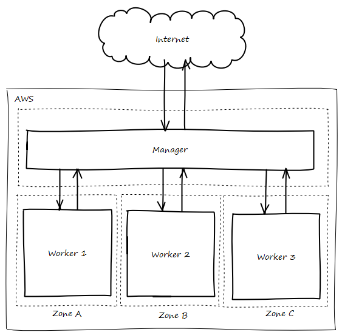

# Sistema

## Estructura
A finales de 2018, se cuentan con 4 servidores.
La estructura actual Actualmente se cuenta con 4 servidores
Se utiliza docker swarm
{: .center}

Todos los servidores pertenecen a una misma red (VPC), pero cada zona cuenta con una subred más una exclusiva para el manager, es decir, existen 4 subredes. Esto hace que si en un futuro aumenta el número de servidores, los nuevos equipos se unirán a las subredes existentes.

El manager es el encargado de exponer de exponer los diferentes servicios a Internet, es por eso que es el único servidor accesible desde el exterior, siempre controlando que puertos se exponen a través de un firewall.

Los workers son servidores de ejecutar los servicios, están distribuidos entre las 3 zonas que provee Amazon en la región "eu-west-1", esta distribución evita que la aplicación deje de responder si alguna de las zonas cae.

Esta distribución de servidores adoptada viene impuesta por Docker Swarm, dónde existe uno o varios managers y un conjunto de servidores workers en los cuáles se desplegan las distintas herramientas.

### Despliegue
Para el aprovisionamiento de todas estas máquinas, con sus respectivos requisitos se ha utilizado como base la plantilla de CloudFormation que proporciona [Docker](https://docs.docker.com/docker-for-aws/){: target="_blank"}. Dicha plantilla ha sido personalizada, por un lado porque se encontró un problema con el plugin ClouStor y el almacenamiento EFS, que hacia que el comportamiento de la aplicación no fuese el adecuado, así que se optó por reemplazar la imagen base utilizada, Moby Linux, por Ubuntu Server, debido ha que era la causante del problema.

En esta plantilla se definen varios parámetros:

* Nombre del stack
* Número de servidores managers y workers
* Clave SSH para conectar a las máquinas
* Tipo de instancias AWS, tanto para managers como workers
* Tipo de discos y capacidades de los mismos

