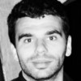
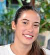
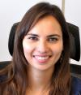
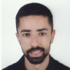

# Equipo

REDMIC es proyecto desarrollado por el [Observatorio Ambiental Granadilla](http://www.oag-fundacion.org)

## Equipo

| Foto | Nombre                       | Cargo                   |
|------|------------------------------|-------------------------|
| {: .rounded} | **Carlos A. González Carballo**  Desarrollador | {: target="_blank"} |
| {: .rounded} | **Ignacio Lorenzo García** Jefe de sistemas | {: target="_blank"}&nbsp;&nbsp;{: target="_blank"} |
| {: .rounded} | **José Andrés Sevilla Hernández**   GIS | {: target="_blank"} |
| {: .rounded} | **Marta González Carballo** Curator de datos |  |
| {: .rounded} | **Ninoska Adern Febles**  Operadora de datos | {: target="_blank"}&nbsp;&nbsp; |
| {: .rounded} | **Noel Alonso Expósito** Desarrollador | {: target="_blank"}&nbsp;&nbsp;{: target="_blank"} |
| {: .rounded} | **Pedro Eduardo Trujillo Brito** Desarrollador | {: target="_blank"}&nbsp;&nbsp;{: target="_blank"} |

## Contacto
Para ponerte en contacto con nosotros por varias vías:

### Email
* <info@redmic.es>
* <info@oag-fundacion.org>

### Teléfono
* +34 922 298 700

### Oficina
Edificio Puerto Ciudad, oficina 1B  
Muelle de Enlace                    
38001 Santa Cruz de Tenerife        
Islas Canarias, España              
