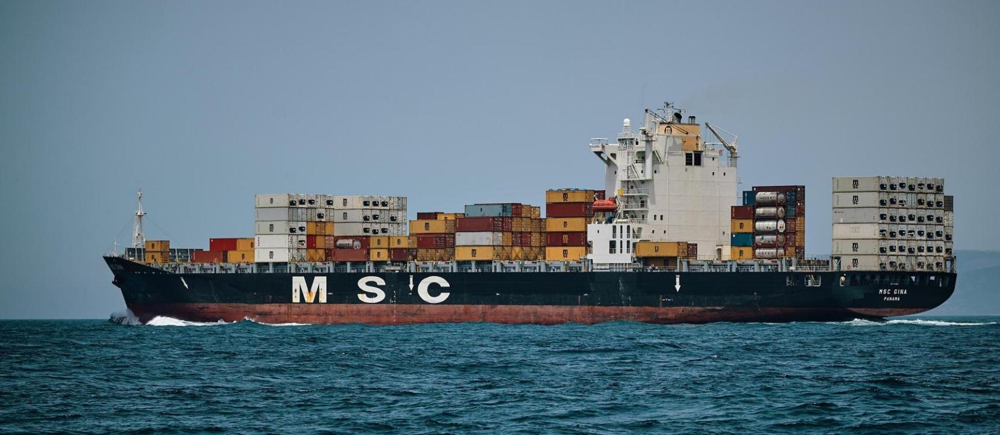
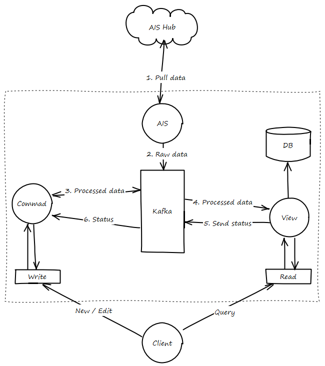

# Buques

{: .shadow}

Tracking de buques para ello, se utilizan los datos AIS, es un transmisor que debe de enviar la posición de los buques en tiempo real. Existe un servicio llamada AISHub el cual provee datos de buques de todo el mundo.

## Flujo de datos

1. El servicio AIS, realiza una petición a [AIS Hub](http://www.aishub.net/){: target="_blank"} para descargar los datos del último minuto. Se ha optado por descargar los datos en formato CSV, ya que pesan menos.
2. Una vez descargados, se descomprimen y se inyectan al canal de datos brutos de buques de Kafka.
3. El microservicio *command* de vessel, escucha este canal de datos brutos, los procesa, comprueba que el buque esté añadido, en caso contrario lo añade, lo enriquece y por último lo envía al canal de guardar buques de Kafka.
4. *View* escucha el canal de guardar buques, almacena el dato en la base de datos.
5. Si el dato se ha guardado correctamente o no, se envía el estado en que acabo la operación, a través de Kafka.
6. *Command* recibe el estado de la operación de guardado, si ha habido algún problema se realizan acciones de compensación y alerta del error. En caso de éxito, el dato ya estaría guardado y listo para ser consultado.

{: .center}
