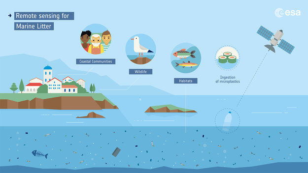

# Concepto
## ¿Qué es REDMIC?
REDMIC está concebido como un sistema para la gestión de datos marinos, sin tener en cuenta su origen; oceanográficos, biológicos, hidrodinámicos, pesqueros, geológicos, tráfico marítimo, etc. en una sola herramienta. Esta característica convierte a REDMIC en un repositorio único.

Esta integración de los datos permitirá en un futuro, poder estudiar hábitats con mayor precisión.

Todo ello siguiendo una filosofía OpenData, OpenScience.

Dicho sistema permite el registro, validación, búsqueda, custodia, recuperación, visualización, análisis y exportación de los datos.

{: .shadow}

Hay tres principios que han tenido especial peso en su concepción:

* Sin datos no se va a ninguna parte, y con datos malos se llega al sitio equivocado. El control de calidad y el rigor en la gestión de datos son cuestiones fundamentales.
* Obtener datos del mar es caro y laborioso. Obtener el dato una vez y potenciar su uso al máximo se hace indispensable.
* Los datos obtenidos con fondos públicos deben ser accesibles a todos los potenciales usuarios.

REDMIC es un sistema de información geográfica en cierto modo peculiar, pues se organiza como repositorio común de datos en función del tipo de dato y no en función de aplicaciones concretas con fines específicos, como es habitual en el diseño de la mayoría de los [GIS](https://es.wikipedia.org/wiki/Sistema_de_informaci%C3%B3n_geogr%C3%A1fica){: target="_blank"}.

La estrategia adoptada en REDMIC consiste en vincular los datos siempre a la actividad que los genera, con toda la información asociada (metadatos), evitando la redundancia de información, que se estructura siguiendo estas cinco preguntas.

| | |
|:-:|-|
|    | Guardar **quién** recoge los datos permitirá dar autoria de los mismos, y poder pedir responsabilidades. |
|  | Saber **qué** se recoge es algo fundamental, sobre todo en un mundo tan cambiante como el medio marino. |
|  | Conocer **dónde** se han recogido los datos permitirá poder realizar correlaciones espaciales con otros datos, o descubrir que especies existen en una zona, algo fundamental para hacer planificación. |
|  | Saber **cómo** se recogen los datos es algo fundamental, y puede hacer variar los resultados de un estudio, así que especificar las técnicas y dispositivos utilizados en la recogida de los datos es algo determinante para un repositorio de datos. |
|   | **Cuándo** se recogen los datos es otro factor importante, ya que permitirá detectar patrones de comportamiento, evaluar la evolución de un ecosistema, etc. |

No todos los datos deben de cumplir todos estos requisitos, dependerá muchas veces del tipo de dato, pero cuanto más de ellos cumpla mejor será el dato y más utilidad se le podrá dar.

## Tipos de datos
Debido a la gran variedad de datos que abarca REDMIC, se pueden clasificar dependiendo del sistema de recogida de los mismos:

* *Directos.* Datos obtenidos desde una medición in situ.
    * *Tiempo real.* Datos transmitidos directamente desde el dispositivo. Hoy en día, muchos dispositivos son capaces de enviar los datos recogidos a través de Internet u otro sistema, ya sea en tiempo real o cada cierto tiempo. Por ejemplo: un correntímetro, una estación meteorológica, etc.
    * *Diferidos.* Datos que necesitan se descargados o extraídos de un dispositivo. Por ejemplo: una sonda multiparamétrica, un perfilador, etc.
* *Indirectos.* Datos obtenidos de muestras.
* *Derivados.* Datos elaborados a partir de otros.

## Fuentes
* **Geológico - geomorfológicos.** Datos referentes a la naturaleza física de los fondos, como el tipo de lecho marino, mineralogía o granulometría. Se incluyen también levantamientos batimétricos, perfiles estratigráficos y los registros de la actividad sísmica.
* **Hidrológico - climatológicos.** Todo lo relacionado con el clima marítimo y la dinámica de las aguas (mareas, corrientes, oleaje, tasas de sedimentación, etc.).
* **Físico - químicos.** Parámetros descriptivos de las condiciones físicas (temperatura, ph, salinidad, etc.) y químicas (nutrientes, oxígeno disuelto, etc.) del agua o los sedimentos.
* **Biológicos.** Todo el complejo universo de datos relacionados con los seres vivos marinos (inventarios de biodiversidad, avistamientos, marcado de animales, producción planctónica, análisis microbiológicos, mareas rojas, clasificación de hábitat, etc.).
* **Elementos antrópicos.** Todo tipo de datos abstractos (p.ej. demarcaciones jurisdiccionales, áreas protegidas, zonas de pesca) y reales (infraestructuras emplazadas en el mar, basuras, vertidos, etc.) cuyo origen es la actividad humana. Este grupo incluye también el tráfico marítimo.
* **Aprovechamientos.** Datos que refieren al aprovechamiento o explotación de recursos marinos por parte del hombre, independiente de su naturaleza. Incluye los geológicos (arenas, etc.), energéticos (mareas, hidrocarburos, etc.) y biológicos (pesca, marisqueo, maricultura, etc.).
* **Especiales.** Datos singulares de diversa índole no asignables a ninguna de las categorías anteriores, aunque puedan estar relacionados con los elementos que contienen. Por ejemplo, las imágenes de satélite o de vídeo, los registros sonoros, los variados resultados de los modelos (mapa de vientos, corrientes, etc.), o el estado de las baterías de un sensor automático.

## ¿Cómo colaborar con REDMIC?
Colaborar con REDMIC tiene sus ventajas:

{: .shadow}

### Aportando datos
Subiendo tus datos a REDMIC hará que tu trabajo obtenga mayor repercusión ya que estará disponible para toda la comunidad científica. Además, podrás utilizar las herramientas existentes sobre tus datos, así como enriquecer tus datos con los existentes.

#### ¿Cómo puedo aportar datos?
Todavía estamos en fase de desarrollo, así que por ahora puedes aportar datos enviándolos por correo a [info@redmic.es](mailto:info@redmic.es), en futuro este proceso se podrá realizar desde la web.

#### ¿Soy investigador y necesito esperar a publicar para liberar mis datos?
En REDMIC, hemos pensado en estos casos donde los investigadores que desean que sus datos no sean accesibles hasta que hagan sus publicaciones, para ello, REDMIC tiene la posibilidad de embargar tus datos por un tiempo determinado, esto hará que los datos sólo sean accesibles por su dueño y personas que el decida. De esta forma, una vez acabe el tiempo de embargo o el investigador así lo decida, los datos se harán públicos para todo el mundo.

Por ética, si tu trabajo ha sido financiado con fondos públicos y no existe alguna restricción jurídica, deberías de liberar tus datos a la comunidad para que puedan ser usados de nuevo en futuros estudios o análisis.

#### No soy investigador
Si no eres investigador, también puedes colaborar, desde REDMIC apoyamos la ["Ciencia ciudadana"](https://es.wikipedia.org/wiki/Ciencia_ciudadana) (Citizen Sciencie) y creemos que es una herramienta muy valiosa, es por ello que si tiene fotos de pescados, aves marinas o algo relacionado con el mar y que creas que puede ser útil envíanosla.

### Reportando errores
No sólo puedes colaborar subiendo datos, también puedes reportar errores en los datos, problemas en la aplicación o incluso sugerencias, todas ellas serán bien recibidas.
