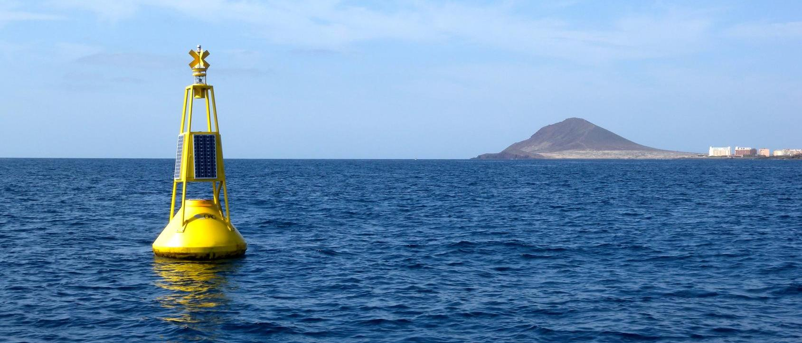
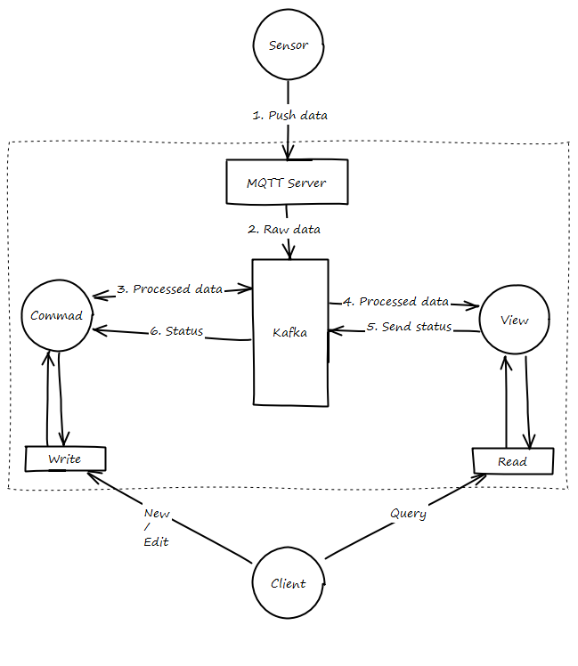

# Real-time
{: .shadow}

En la actualidad muchos dispositivos envía los datos en tiempo real: mareógrafos, correntímetros, estaciones meteorológicas, etc. es por eso, que debe existir un camino para incorporar estos datos.

En principio se optará por usar protocolos abiertos, como [MQTT](http://mqtt.org).

## Flujo de datos

1. El dispositivo envía los datos a REDMIC, utilizando el protocolo MQTT al servidor MQTT.

!!! tip
    En caso de que el dispositivo utilice un protocolo propietario, o ya tenga un sistema de recepción de datos, se pueden implementar scripts que envíen los datos desde el servidor o que descarguen desde un FTP y realicen el resto del procedimiento.

2. Una vez recibidos los datos se inyectan al canal de Kafka para datos brutos de sensores.
3. El microservicio *command* para datos de sensores, escucha este canal de datos brutos, los procesa, lo enriquece y por último lo envía al canal de guardar datos de sensores de Kafka.
4. *View* escucha el canal de guardar datos y almacena el dato en la base de datos.
5. Si el dato se ha guardado correctamente o no, se envía el estado en que acabo la operación, a través de Kafka.
6. *Command* recibe el estado de la operación de guardado, si ha habido algún problema se realizan acciones de compensación y alerta del error. En caso de éxito, el dato ya estaría guardado y listo para ser consultado.

{: .center}